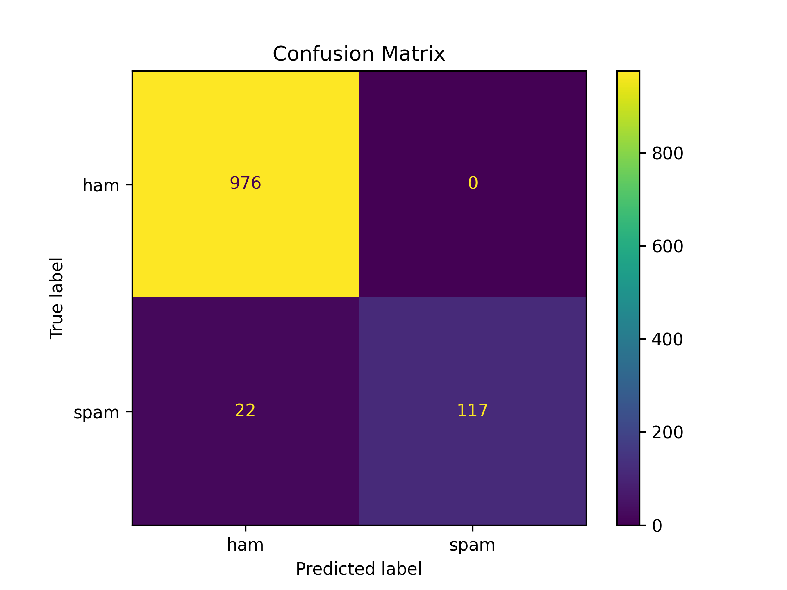

# Spam Mail Classifier
An ML that can be used to classify an email as spam or not spam.

## How to run
Clone the repo go into the directory make a `virtual env` with `python3 -m venv venv` and install the required dependencies with `pip install -r requirements.txt`. Run `train.py` to train the model. The trained model will be saved to the `models` directory. Use `predict.py` to test the model change input to test various inputs and get predictions on those.

## Info about the model and graphs
It is using *Multinomial Naive Bayes*. The accuracy of the model is *98%*.

### Confusion Matrix

This is the Confusion Matrix for our model. It performed very well on our test data with *(979+117) = 1096* correct predictions. There were some errors with predictions *22* spam messages were predicted as not spam.
 